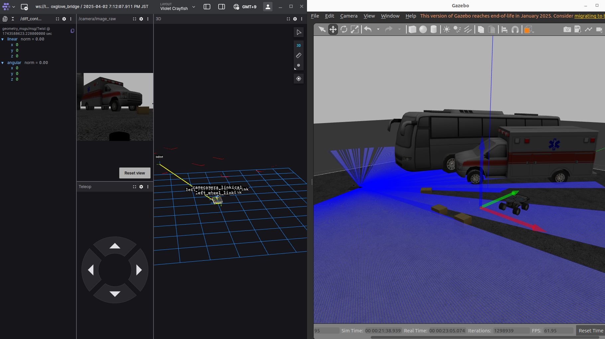

# av

Autonomous vehicle in simulation and hardware

ROS2 packages (tested with Ubuntu 22.04 Humble):

- av_bringup: LiDAR, realsense depth camera, ros2_control motor bringup
- av_description: urdf with sensor frames
- av_hardware: ros2_control hardware interface for CyberGear motors

